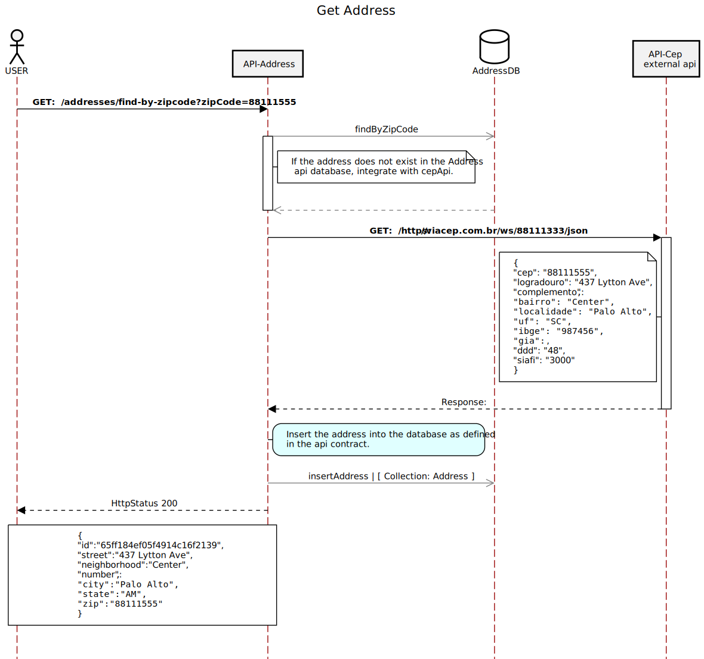

# Address Api.

* API developed following the non -blocking reactive model with 17 Java and Spring Webflux.

### ⚡ Technologies

These are some of the technologies and tools that I work with:<br>


### Flow to obtain the address


---

## Configuration for telemetry collection with Optionlemetry and Jaeger.

### Imagen Docker [ docker-compose.yaml ] - [ OpenTelemetry e Jaeger ]
```yaml
version: '3.8'
networks:
  public:
  monit:
  data:
  api:

services:
  collector-api:
    image: otel/opentelemetry-collector:latest
    container_name: collector-api
    volumes:
      - ./collector/otel-collector-config.yaml:/etc/otel-collector-config.yaml
    command: ["--config=/etc/otel-collector-config.yaml"]
    ports:
      - 4317:4317
      - 4318:4318
    networks:
      - api
      - monit

  jaeger-api:
    image: jaegertracing/opentelemetry-all-in-one
    container_name: jaeger-api
    ports:
      - 16686:16686
    networks:
      - monit
    depends_on:
      - collector-api
```
### otel-collector-config-yaml
```yaml
receivers:
  otlp:
    protocols:
      grpc:
      http:
exporters:
  otlp/jaeger:
    endpoint: jaeger-api:4317
    tls:
      insecure: true
service:
  pipelines:
    traces:
      receivers: [otlp]
      exporters: [otlp/jaeger]
```

### Configuration of Spring Actuator in your Spring application from Collecting Detailed Metrics
```yaml
management:
  tracing:
    sampling:
      probability: 1.0
  endpoints:
    web:
      exposure:
        include: '*'
  endpoint:
    health:
      show-details: always
  metrics:
    enable:
      jvm: true
    export:
      prometheus:
        enabled: true
    tags:
      application: 'NAME OF YOUR API, for example - "address-api" '
    distribution:
      slo:
        http: '5ms,10ms,25ms,50ms,100ms,200ms,300ms,400ms,500ms,1s,2s'
      percentiles-histogram:
        http:
          server:
            requests: true

info:
  app:
    name: '@project.name@'
    description: '@project.description@'
    version: '@project.version@'
    encoding: '@project.build.sourceEncoding@'
    java:
      version: '@java.version@'

```

### Maven

```xml
<!--Dependencies -->
<dependency>
    <groupId>org.springframework.boot</groupId>
    <artifactId>spring-boot-starter-actuator</artifactId>
</dependency>

<dependency>
    <groupId>io.opentelemetry</groupId>
    <artifactId>opentelemetry-api</artifactId>
</dependency>

<dependency>
    <groupId>io.micrometer</groupId>
    <artifactId>micrometer-registry-prometheus</artifactId>
    <scope>runtime</scope>
</dependency>

<dependency>
    <groupId>com.google.protobuf</groupId>
    <artifactId>protobuf-java</artifactId>
    <version>3.18.1</version>
</dependency>
        
<!--Management -->
<dependencyManagement>
    <dependencies>
        <dependency>
            <groupId>org.springframework.cloud</groupId>
            <artifactId>spring-cloud-dependencies</artifactId>
            <version>2021.0.9</version>
            <type>pom</type>
            <scope>import</scope>
        </dependency>
    
        <dependency>
            <groupId>io.opentelemetry</groupId>
            <artifactId>opentelemetry-bom</artifactId>
            <version>1.37.0</version>
            <type>pom</type>
            <scope>import</scope>
        </dependency>
    
        <dependency>
            <groupId>org.springframework.cloud</groupId>
            <artifactId>spring-cloud-sleuth-otel-dependencies</artifactId>
            <version>1.1.2</version>
            <scope>import</scope>
            <type>pom</type>
        </dependency>
    </dependencies>
</dependencyManagement>
```
### I download the option of Optionlemetry at the link. https://github.com/open-telemetry/opentelemetry-java-instrumentation
 
* To run the API Jar, follow the steps demonstrated in the step-by-step walkthrough video: <a href="https://youtu.be/o101JLsEEiY?si=8o7jfxre3m-5vplP" target="_blank">step-by-step walkthrough video</a>
```
java -javaagent:opentelemetry/opentelemetry-javaagent.jar -Dotel.service.name=address-api -Dotel.traces.exporter=otlp -Dotel.metrics.exporter=none -Dotel.exporter.otlp.endpoint=http://localhost:4318 -Dotel.exporter.otlp.protocol=http/protobuf -jar target/*.jar
```
---

### Technology References
* [Opentelemetry Docs](https://opentelemetry.io/docs)
* [Jaeger Docs](https://www.jaegertracing.io/docs)
* [Spring Webflux](https://docs.spring.io/spring-framework/reference/web/webflux.html)


